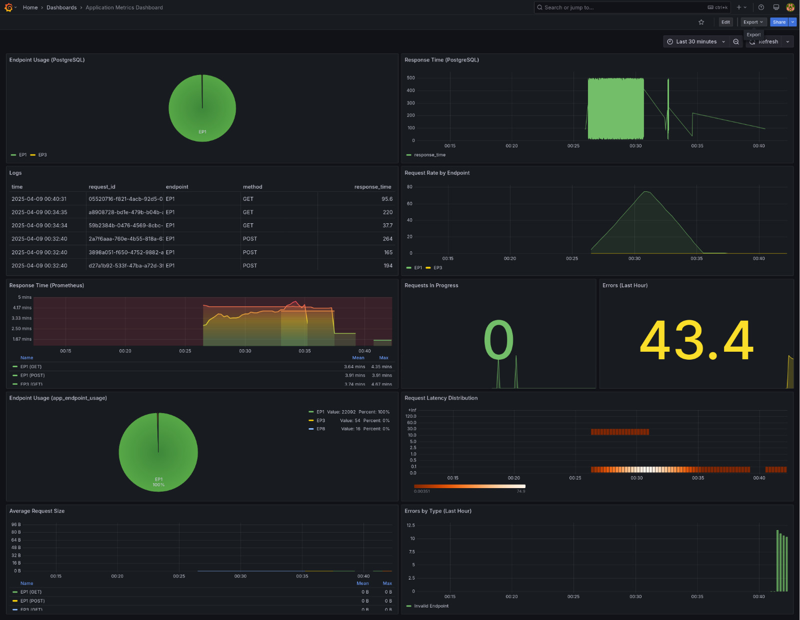

# Distributed Log Monitoring

Keeping tabs on what’s happening across your systems in real time is more important than ever — whether you're chasing down bugs, keeping things secure, or just making sure everything's running smoothly. \*Enter\* this project.

## Build Steps

```shell
docker-compose up --build
```
Nice setup! Here's a **cool, dev-friendly README** you can drop into your GitHub repo to showcase your log analytics platform. It highlights the tech stack, explains how to get started, and shows off the key features in a clean, engaging way.

---
##  Dashboards & Ports

| Service       | URL                             |
|---------------|----------------------------------|
| Grafana       | [localhost:3000](http://localhost:3000) *(user: admin / pass: admin)* |
| Prometheus    | [localhost:9090](http://localhost:9090) |
| Loki          | [localhost:3100](http://localhost:3100) |
| API           | [localhost:5000](http://localhost:5000) |
| Kafka Brokers | `kafka1:9092`, `kafka2:9094`, `kafka3:9095` |
| PostgreSQL    | `localhost:5432` (db: logs_db / user: postgres / pass: password) |

---

##  Log Sources

- `./api/logs/` – Logs generated by the API
- `./consumer/logs/` – Logs from the Kafka consumer
- System logs from `/var/log/` (via Promtail)

---

##  Features

- [x] Real-time log ingestion with Kafka
- [x] Easy log querying via Loki
- [x] Structured storage in PostgreSQL
- [x] Beautiful, pre-configured Grafana dashboards
- [x] Lightweight and **memory efficient**
- [x] Plug-and-play with Docker Compose

---

## Dev Notes

- Topics auto-created: `application_logs`, `application_errors`
- Memory usage optimized (`-Xmx512M -Xms256M` for Kafka)
- Default Kafka replication: 3, partitions: 3

---

##  Customization

Want to add your own microservice or log source? Just plug it into Kafka or Promtail and extend the dashboards in Grafana. It’s modular and easy to scale.

---

##  Screenshots



---

##  License

MIT — use it, build on it, make it better.

---
